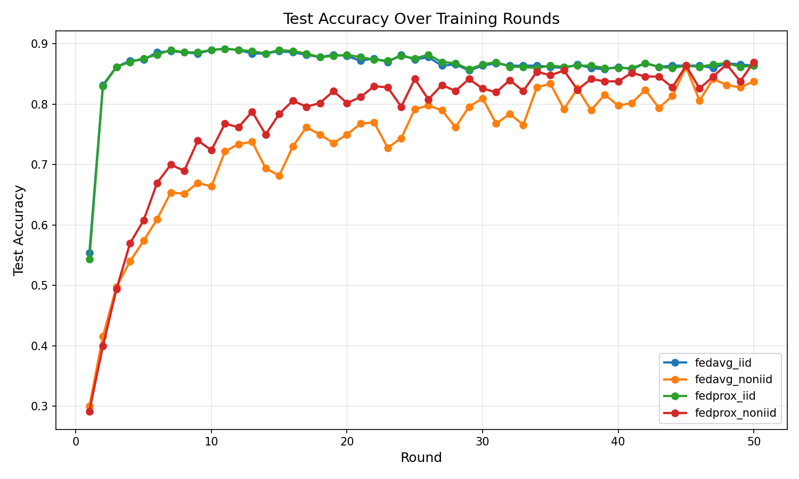
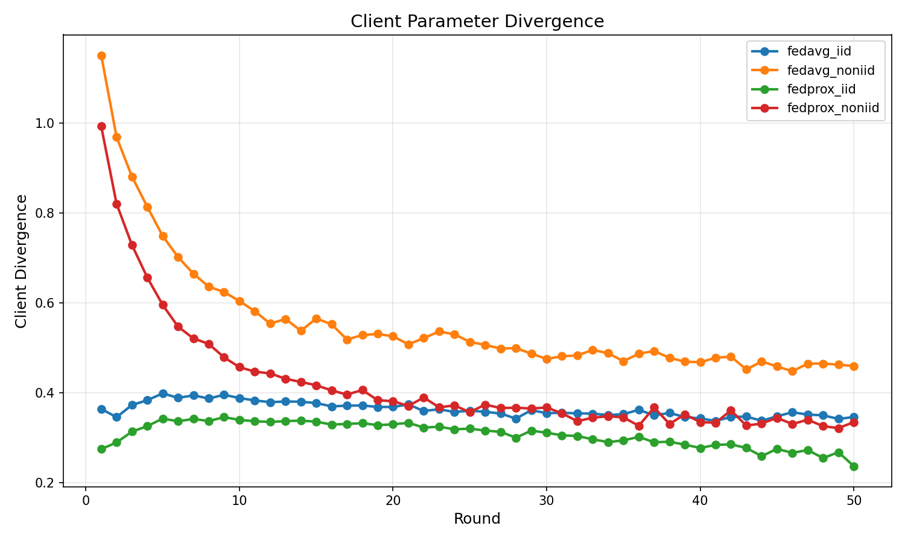

# Failure Modes of Federated Fine-Tuning Under Non-IID Data

A systematic empirical study comparing FedAvg and FedProx algorithms on text classification using DistilBERT, under controlled non-IID conditions.

## Research Questions

1. When does federated training of language models **break down** under data heterogeneity?
2. How do **FedAvg** and **FedProx** behave differently under non-IID distributions?
3. What role does **client parameter divergence** play in model quality?
4. What are the **failure modes** under extreme conditions (high LR, extreme skew)?

## Key Findings

| Experiment | Final Accuracy | Divergence |
|------------|----------------|------------|
| FedAvg + IID | 86.4% | 0.35 |
| FedAvg + Non-IID | 83.8% | 0.46 |
| FedProx + IID | 86.4% | 0.24 |
| **FedProx + Non-IID** | **87.0%** | 0.33 |

- FedProx outperforms FedAvg by **3.2%** under non-IID conditions
- Proximal regularization reduces client divergence by ~30%
- High learning rates cause **catastrophic divergence** (>20x baseline)

## Project Structure

```
├── src/
│   ├── data/
│   │   ├── partitioner.py      # Non-IID partitioning (Dirichlet-based)
│   │   └── datasets.py         # AG News dataset loading
│   ├── models/
│   │   └── lora_model.py       # DistilBERT model utilities
│   ├── federated/
│   │   └── client.py           # FederatedClient & FedProxClient
│   └── metrics/
│       └── metrics.py          # Metrics collection
├── train.py                    # Main training script
├── run_experiments.py          # Experiment runner
├── report.tex                  # IEEE-format research report
├── results/
│   └── plots/                  # Generated experiment plots
└── requirements.txt
```

## Installation

```bash
# Create virtual environment
python3 -m venv venv
source venv/bin/activate

# Install dependencies
pip install -r requirements.txt
```

### Requirements
- Python 3.8+
- PyTorch
- Transformers (HuggingFace)
- datasets
- numpy, matplotlib

## Quick Start

### Single Experiment

```bash
# FedAvg with IID data (baseline)
python train.py -a fedavg -p iid

# FedAvg with non-IID data
python train.py -a fedavg -p topic_skew

# FedProx with non-IID data
python train.py -a fedprox -p topic_skew

# FedProx with extreme non-IID (alpha=0.01)
python train.py -a fedprox -p topic_skew --alpha 0.01

# Custom configuration
python train.py -a fedprox -p topic_skew -c 10 -r 50 --mu 0.1 --lr 2e-5
```

### Systematic Experiments

```bash
# Quick test (3 experiments, ~5 min)
python run_experiments.py --mode quick

# Full comparison (4 experiments, ~15 min)
python run_experiments.py --mode main

# Failure mode analysis
python run_experiments.py --mode failure

# Analyze existing results
python run_experiments.py --mode analyze
```

## Command-Line Arguments

| Argument | Short | Default | Description |
|----------|-------|---------|-------------|
| `--algorithm` | `-a` | `fedavg` | Algorithm: `fedavg` or `fedprox` |
| `--partition` | `-p` | `iid` | Data partition: `iid` or `topic_skew` |
| `--clients` | `-c` | `5` | Number of federated clients |
| `--rounds` | `-r` | `5` | Communication rounds |
| `--local-epochs` | `-e` | `2` | Local training epochs per round |
| `--samples` | `-n` | `2000` | Training samples from AG News |
| `--batch` | `-b` | `32` | Batch size |
| `--alpha` | | `0.1` | Dirichlet concentration (lower = more non-IID) |
| `--mu` | | `0.1` | FedProx proximal term strength |
| `--lr` | | `2e-5` | Learning rate |
| `--seed` | | `42` | Random seed |

## Federated Learning Algorithms

### FedAvg (Baseline)
Standard federated averaging: clients train locally, server averages parameters weighted by sample count.

### FedProx
Adds proximal regularization to limit client drift:

```
L_local = L_task + (μ/2) ||w - w_global||²
```

The proximal term penalizes deviation from the global model, reducing client divergence under heterogeneous data.

## Non-IID Data Generation

We use **Dirichlet-based label allocation** to create controlled heterogeneity:

```python
p_k ~ Dir(α · 1_C)  # Sample label proportions for client k
```

| Alpha (α) | Heterogeneity | Effect |
|-----------|---------------|--------|
| α → ∞ | None (IID) | Uniform label distribution |
| α = 1.0 | Low | Slight imbalance |
| α = 0.1 | High | Significant skew |
| α = 0.01 | Extreme | Near single-class clients |

## Metrics Tracked

- **Test Accuracy**: Classification accuracy on held-out test set
- **Training Loss**: Average loss across clients
- **Client Divergence**: L2 distance between client parameters and their mean

## Model Configuration

| Parameter | Value |
|-----------|-------|
| Model | DistilBERT (66M params) |
| Trainable | ~15M (22%) - last 2 layers + classifier |
| Dataset | AG News (4 classes) |
| Sequence Length | 64 tokens |
| Optimizer | AdamW |

## Results

### Main Experiments



### Failure Modes
- **Extreme skew (α=0.01)**: 80.6% accuracy, slow convergence
- **High LR (1e-3)**: 70.4% accuracy, catastrophic divergence (~21)
- **Many clients (K=10)**: 88.2% accuracy (improved!)

## LaTeX Report

A complete IEEE-format research report is available:

```bash
# Compile the report
pdflatex report.tex
```

## References

- **FedAvg**: McMahan et al., "Communication-Efficient Learning of Deep Networks from Decentralized Data", AISTATS 2017
- **FedProx**: Li et al., "Federated Optimization in Heterogeneous Networks", MLSys 2020
- Claude-Code: Helped in coding execution.

## Authors

- Aviral Vishesh Goel (IIT Bombay)
- Adit Srivastava (IIT Bombay)
- Aagam Shah (IIT Bombay)


